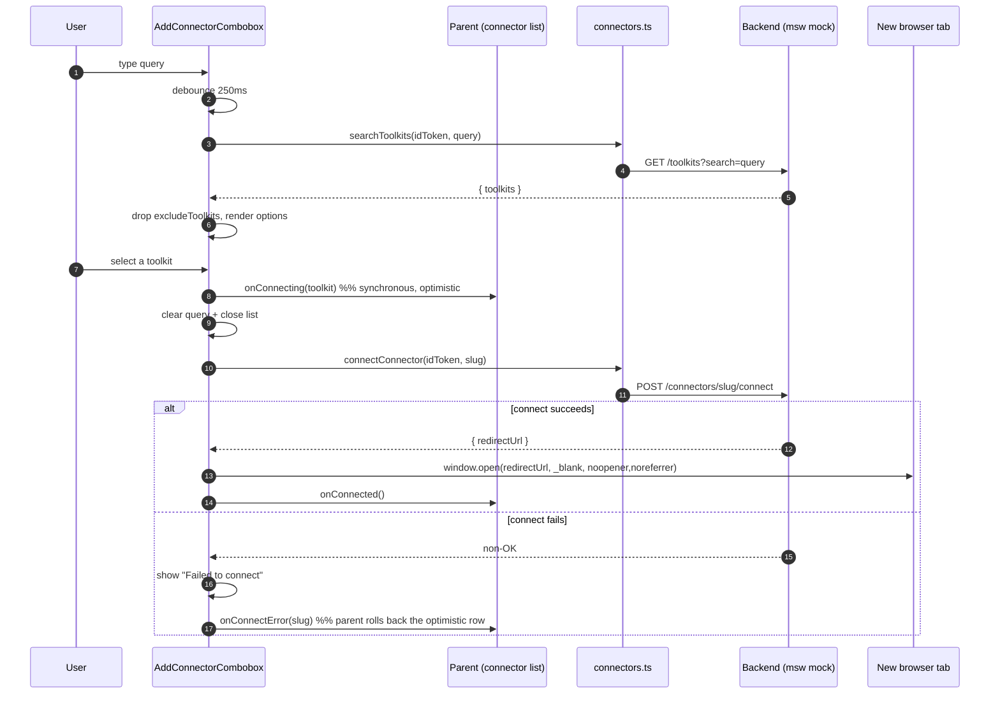
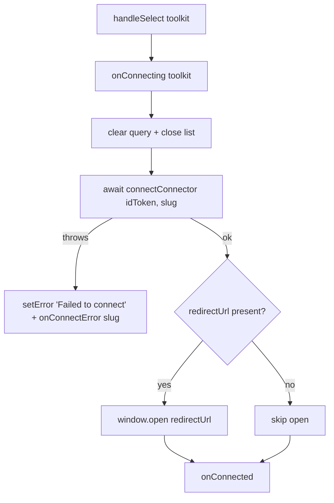
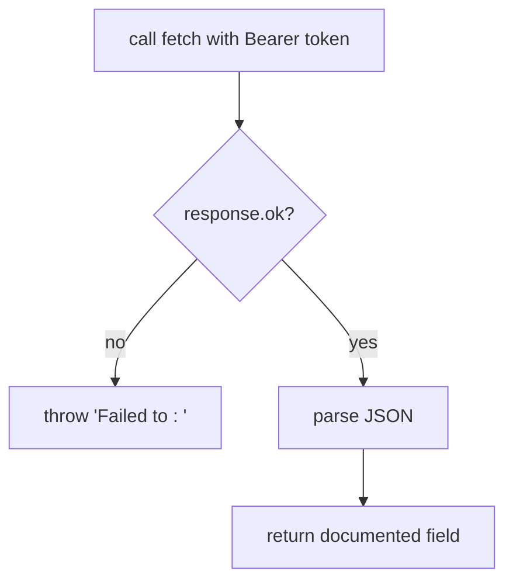

# Diagrams — Frontend Connectors Module

## Connect flow (swimlane)

The optimistic connect path: the combobox notifies the parent the moment a toolkit is
picked, then completes the connect + redirect round trip.

## Combobox select decision

## API client error contract

